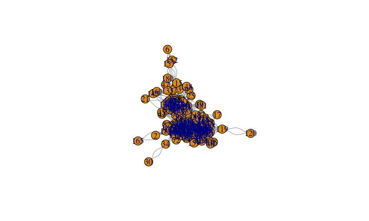
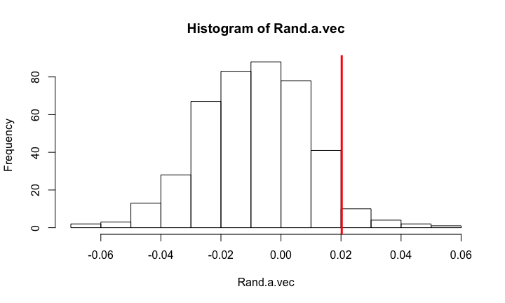

# The jazz of web
Giulio Valentino Dalla Riva  
June 17, 2016  

## Webs

Relational structures.

- Food webs
- Proteome, Diseosome, -ome -ome -ome
- You name it
- Jazz musicians collaborations

## Webs

Today is [jazz](https://cordame.bandcamp.com/album/satie-variations)!

## R packages | What do we need?


```r
library("igraph") # To handle the webs objects and plot them

options(stringsAsFactors = FALSE) # To handle the web datasets
```

## R packages | What may we need?

Useful but not today:

- `library("dplyr")` to filter, select, mutate
- `library("magrittr")` use pipes, everything is nicer ( `%>%` )
- ...

## Ingredients: interactions data | Better open

List of edges of the network of Jazz musicians. Data compiled by members of our group. Please cite P.Gleiser and L. Danon , Adv. Complex Syst.6, 565 (2003).
<http://deim.urv.cat/~alexandre.arenas/data/welcome.htm>


```r
Source.url <- "http://deim.urv.cat/~alexandre.arenas/data/xarxes/jazz.zip"
```

## Ingredients: interactions data | Better open

What do we have


```r
temp.file <- tempfile()
download.file(Source.url, temp.file, mode="wb")
unzip(temp.file, list=TRUE)
```

```
##       Name Length                Date
## 1 jazz.net 151089 2007-02-02 13:01:00
```

## Ingredients: interactions data | Better open

And what is that?


```r
unzip(temp.file, 'jazz.net')
cat(readLines('jazz.net')[1:10], sep="\n")
```

```
## *Vertices     198
## *Arcs
## *Edges
##        1       8        1
##        1      24        1
##        1      35        1
##        1      42        1
##        1      46        1
##        1      60        1
##        1      74        1
```

## Ingredients: interactions data | Better open

We like it


```r
edge.df <- read.table("jazz.net", skip = 3)
unlink(temp.file)
```

Memento: igraph goes `from`, `to`

## Ingredients| Knead the data to a web


```r
edge.df[1:10,]
```

```
##    V1 V2 V3
## 1   1  8  1
## 2   1 24  1
## 3   1 35  1
## 4   1 42  1
## 5   1 46  1
## 6   1 60  1
## 7   1 74  1
## 8   1 78  1
## 9   1 81  1
## 10  1 95  1
```

## Ingredients| Knead the data to a web


```r
names(edge.df) <- c("Source","Sink","Weight")
```

## Ingredients| Knead the data to a web

The igraph solo


```r
Jazz.graph  <-  graph.data.frame(edge.df[,c("Source","Sink")], directed=FALSE)
```

## Ingredients| A graph!

What do we have?

How many vertices in the graph? How many edges?

```r
vcount(Jazz.graph)
```

```
## [1] 198
```

```r
ecount(Jazz.graph)
```

```
## [1] 5484
```

## Plot it!

What do we have?


```r
plot(Jazz.graph)
```

<!-- -->


## Plot it!

That was blah...

- Multiple links.
- We made Edward Tufte sad.


```r
Jazz.graph <- simplify(Jazz.graph)
```

## What do we want to know?

Well, I thought about assortativity (homophyly):


```r
Jazz.a <- assortativity_degree(Jazz.graph, directed = FALSE)
Jazz.a
```

```
## [1] 0.0202374
```

## And is that significant?

Comparison with expected value from _null model_.

## Null model

A null model is as random as Jazz improvisation is.

> True originality, and thus true creativity, never takes place in a historical vacuum; it is always rooted to something that has gone before.
> Brad Mehldau - [Jazz's high stakes and tragic failures](http://www.bradmehldau.com/new-page)

## Null model: constraints and randomization

For example, let's keep fixed each node degree and change everything else:


```r
edge_random.df <- get.edgelist(Jazz.graph, name = FALSE)
edge_random.df$Sink <- sample(edge.df$Sink)
```

```
## Warning in edge_random.df$Sink <- sample(edge.df$Sink): Coercing LHS to a
## list
```

```r
Jazz_random.graph  <-  graph.data.frame(edge_random.df, directed=FALSE)
```

## Null model: constraints and randomization

We can wrap that in a function:


```r
randomize_fixdegrees <- function(graph){
  edge_random.df <- get.edgelist(graph, name = FALSE)
  edge_random.df[,2] <- sample(edge_random.df[,2])
  random.graph  <-  graph.data.frame(edge_random.df, directed=FALSE)
  return(random.graph)
}
```

## Null model: constraints and randomization

We can wrap that in a function:


```r
Rand.graph <- randomize_fixdegrees(Jazz.graph)
Rand.a <- assortativity_degree(Rand.graph, directed = FALSE)
Rand.a
```

```
## [1] -0.02496473
```

## Simulated p-value fyeah! | Let's have a chat about p-values later

We can wrap that in a function:


```r
N <- 420
Rand.a.vec <- replicate(N,assortativity_degree(randomize_fixdegrees(Jazz.graph),FALSE))

p.sim <- sum(Rand.a.vec > Jazz.a) / N
p.sim
```

```
## [1] 0.04047619
```


## Effect size plot

We can wrap that in a function:


```r
hist(Rand.a.vec)
abline(v = Jazz.a, col = "red", lwd = 3)
```

<!-- -->
