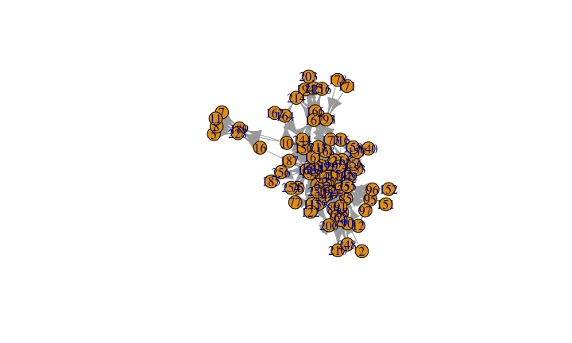

# The fine art of webs
Giulio Valentino Dalla Riva  
June 17, 2016  


## Webs

Relational structures.

- Food webs
- Proteome, Diseosome, -ome -ome -ome
- You name it
- Jazz musicians collaborations

## R packages | What do we need?


```r
library("igraph") # To handle the webs objects and plot them
library("dplyr") # Filter, select, mutate, ... data sets
library("magrittr") # Provides pipes ( %>% )

options(stringsAsFactors = FALSE) # To handle the web datasets
```

## Ingredients: interactions data | The best stuff is Open Access

Ryan F. Hechinger, Kevin D. Lafferty, John P. McLaughlin, Brian L. Fredensborg, Todd C. Huspeni, Julio Lorda, Parwant K. Sandhu, Jenny C. Shaw, Mark E. Torchin, Kathleen L. Whitney, and Armand M. Kuris (2011). *Food webs including parasites, biomass, body sizes, and life stages for three California/Baja California estuaries*. **Ecology** 92:791---791. <http://dx.doi.org/10.1890/10-1383.1>


```r
Web.source <- "http://esapubs.org/archive/ecol/E092/066/CSMweb_Links.txt"
```

## Ingredients: interactions data | The best stuff is Open Access


```r
Web.source %>%
  url %>% # Open the connection
  # and read the data
  read.csv(sep = "\t") ->
Raw.web.data
```


## Ingredients: Knead the data to a web (1/2)


```r
Raw.web.data %>%
  filter(LinkType %in% "predation") %>% # Filter only the relevant interactions
  filter(LinkEvidence %in% "observed") %>% # and only if directly observed
  select(ResourceNodeID,ConsumerNodeID) -> # Select the column of From and To
edge_df
```

## Ingredients: Knead the data to a web (pause)


```r
edge_df[1:10,]
```

```
##    ResourceNodeID ConsumerNodeID
## 1              12             85
## 2               2             88
## 3               6             88
## 4              12             88
## 5              12             90
## 6               6             92
## 7              12             92
## 8              12             97
## 9               6            115
## 10              6            119
```

## Ingredients: Knead the data to a web (2/2)


```r
edge_df %>%
  graph.data.frame(directed=TRUE) -> # the igraph magic
CSM.graph
```

## Ingredients| A graph!

What do we have?


```r
CSM.graph %>% vcount # How many vertices in the graph?
```

```
## [1] 80
```

```r
CSM.graph %>% ecount # How many edges in the graph?
```

```
## [1] 242
```

## Plot it!

What do we have?


```r
CSM.graph %>% plot # It won't be nice
```

<!-- -->

## We'll get something better, come and see!
